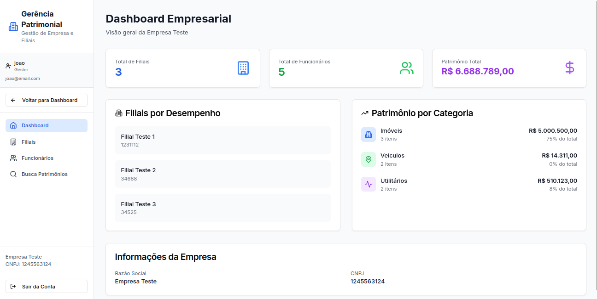
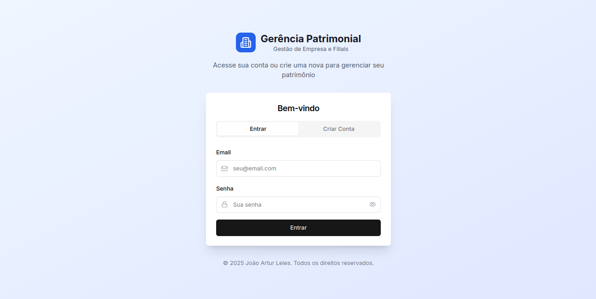
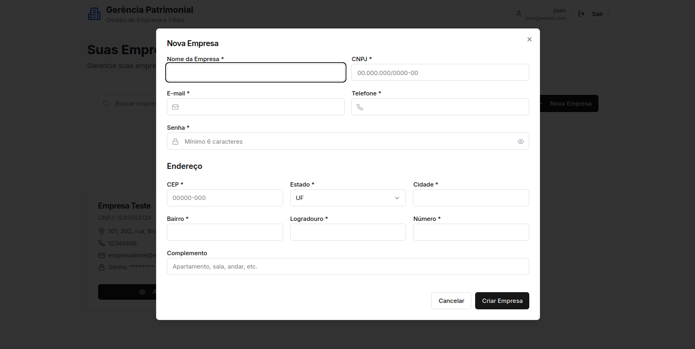
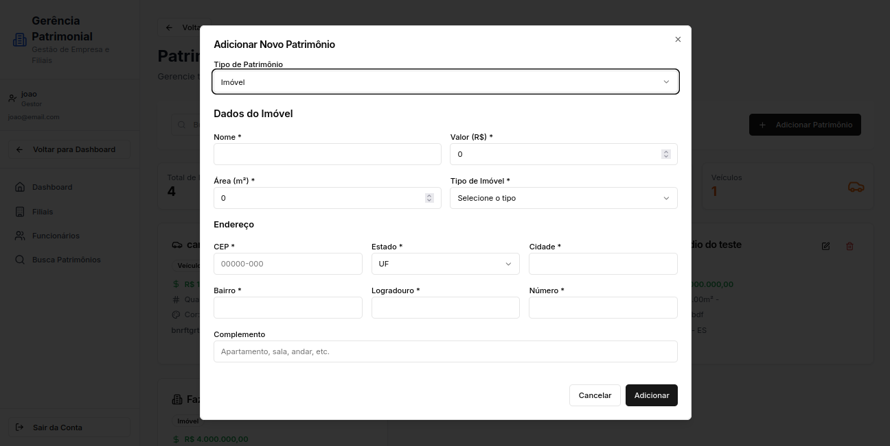
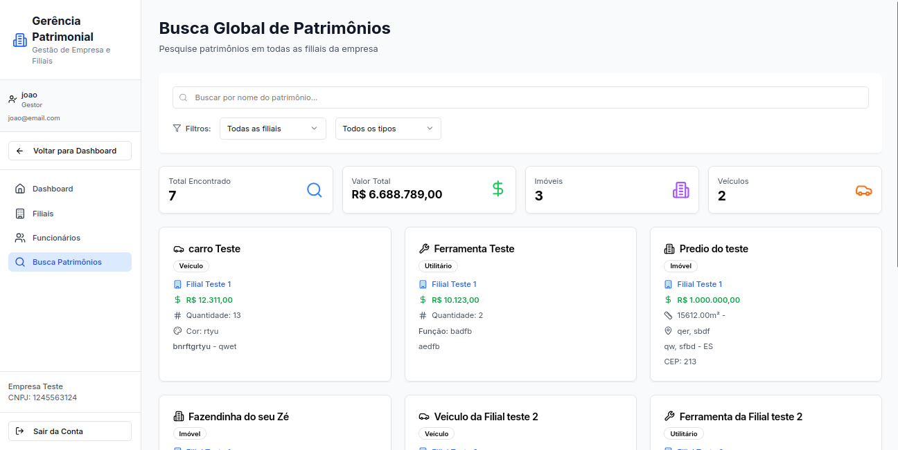
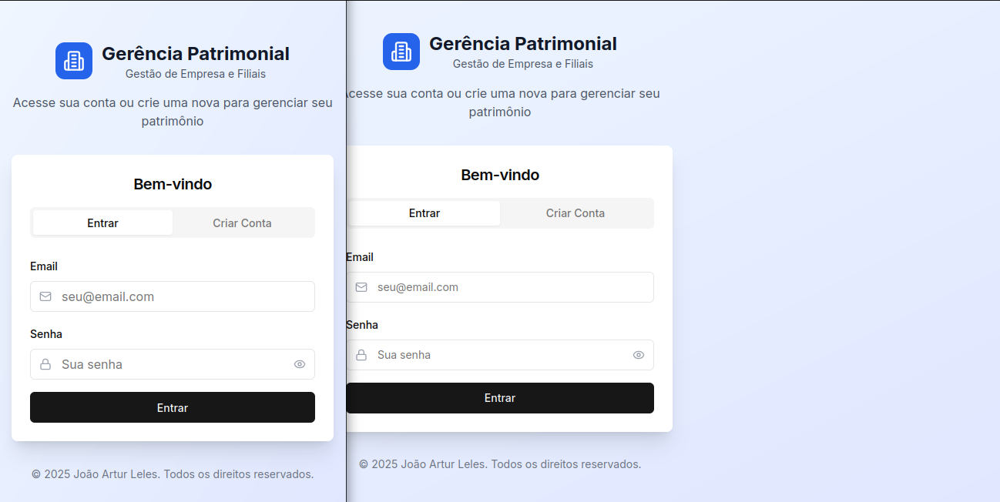

# Gerência Patrimonial V2 Frontend

## 📖 Sobre o Projeto

Este é o repositório do frontend da aplicação **Gerência Patrimonial V2**, uma interface de usuário moderna e responsiva para o sistema de gestão de patrimônio empresarial. A aplicação foi construída com Next.js e TypeScript, utilizando o App Router para uma navegação rápida e otimizada.

### 🔗 Links Úteis

| Recurso | Link |
| :--- | :--- |
| **Aplicação** | [gerencia-patrimonial.vercel.app](https://gerencia-patrimonial.vercel.app/) |
| **Documentação da API** | [gerencia-patrimonial-api.onrender.com](https://gerencia-patrimonial-api.onrender.com/api/schema/swagger-ui/) |
| **Documentação (Artefatos)** | [joao-artl.github.io/Gerencia_Patrimonial_V2/](https://joao-artl.github.io/Gerencia_Patrimonial_V2/) |
| **Repositório (Back-End)** | [github.com/joao-artl/Gerencia_Patrimonial_V2](https://github.com/joao-artl/Gerencia_Patrimonial_V2) |

## ✨ Funcionalidades Principais

<table>
  <tr>
    <td align="center">
      <strong>Dashboards Dinâmicos</strong><br>
      
      <p>Visões gerais para gestores com dados consolidados de toda a empresa.</p>
    </td>
    <td align="center">
      <strong>Autenticação Segura</strong><br>
      
      <p>Sistema de login e cadastro com tokens JWT (Access & Refresh Tokens).</p>
    </td>
  </tr>
  <tr>
    <td align="center">
      <strong>Gerenciamento de Entidades</strong><br>
      
      <p>CRUD completo para Empresas, Filiais e Funcionários.</p>
    </td>
    <td align="center">
      <strong>Gestão de Patrimônio</strong><br>
      
      <p>Cadastro e gerenciamento de múltiplos tipos de patrimônios.</p>
    </td>
  </tr>
    <tr>
    <td align="center">
      <strong>Busca e Filtros</strong><br>
      
      <p>Funcionalidades de busca e filtro em todas as listagens.</p>
    </td>
    <td align="center">
      <strong>Design Responsivo</strong><br>
      
      <p>A interface se adapta a diferentes tamanhos de tela, de desktops a dispositivos móveis.</p>
    </td>
  </tr>
</table>

## 🛠️ Tecnologias Utilizadas

* **Framework:** Next.js 14+ (com App Router)
* **Linguagem:** TypeScript
* **Estilização:** Tailwind CSS
* **Componentes de UI:** shadcn/ui
* **Comunicação com API:** Axios
* **Testes E2E:** Selenium com Pytest
* **Hospedagem:** Vercel

## 🚀 Como Rodar Localmente

1.  **Pré-requisitos:**
    * A **API do backend** deve estar rodando (localmente via Docker ou no deploy do Render).
    * [Node.js](https://nodejs.org/)
    * [Docker](https://www.docker.com/products/docker-desktop/)
    * [Docker Compose](https://docs.docker.com/compose/install/)

2.  **Clone o repositório:**
    ```bash
    git clone https://github.com/joao-artl/Gerencia_Patrimonial_V2_Front_End.git
    cd Gerencia_Patrimonial_V2_Front_End/
    ```

3.  **Crie o arquivo de ambiente:**
    * Crie um arquivo `.env` na raiz do projeto.
    * Adicione a variável de ambiente apontando para a sua API:
        ```
        NEXT_PUBLIC_API_URL=http://localhost:8000/api
        ```

4.  **Inicie o servidor de desenvolvimento:**
    ```bash
    docker-compose up --build
    ```
    A aplicação estará disponível em `http://localhost:3000`.

5.  **Para parar os containers:**
    ```bash
    docker compose down -v
    ```


### Testes Automatizados de Interface

Este projeto contém testes End-to-End (E2E) com Selenium para validar o fluxo do usuário.

1.  **Instale as dependências de teste (Python):**
    ```bash
    # (Opcional) Crie um ambiente virtual
    python3 -m venv venv-tests
    source venv-tests/bin/activate
    
    pip install -r tests/requirements.txt
    ```

2.  **Execute os testes:**
    * Garanta que tanto o backend quanto o frontend estejam rodando localmente.
    * Execute o Pytest:
        ```bash
        pytest tests/test_fluxo_completo.py
        ```
